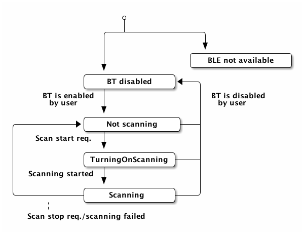
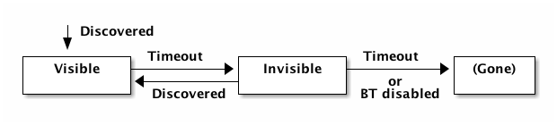

# CUBB Internals

## Architecture/structure
The SDK is split into two part: a common C# part, and a platform-dependent part (written in Java, Swift, or C#, depending on the platform).
Between them is a thin bridge, also in C#, but platform-dependent.

The common "top" part runs inside Unity.

The bottom part may run within the same CLI VM (on platforms where this is possible), or it may run as native code.

## Internal Bridge API
The interface between the "top" and "bottom" parts is intended to be as narrow as reasonable.

It must cover:

- Device Discovery
- Accessing device properties pre-connection
- Connecting to and disconnecting from devices
- Data packet streams to and from connected devices.
- Basic error reporting.

The API is by necessity asynchronous (since downward operations may not block and upward messages are made asynchronous by Unity); in the "downward" direction, though, it may include synchronous "dirty-read" operations if deemed appropriate.

The API is defined in a subsequent section.

## State machines

There is a state machine for the Bluetooth adapter state.
For each known device there are two state machines: a *visibility* and a *connection* state machine.
The "bottom" part of the SDK tracks these states, and sends updates to the "top" part.

The device state machine also specifies which device properties are available in which states.

### Adapter state machine

### Device state machines

The following device properties are always available when the device is known:

- Device ID
- Device name
- Signal strength (RSSI value), as seen from the host
- *TODO: more?*

## Internal API
The internal bridge API is - on the Unity/C# side - embodied in the interfaces in
[`CoreUnityBleBridge.Model.IUnityToNative`](/cubb-unity/Assets/CoreUnityBleBridge/Model/IUnityToNative.cs) and
[`CoreUnityBleBridge.Model.INativeToUnity`](/cubb-unity/Assets/CoreUnityBleBridge/Model/INativeToUnity.cs).
 Detailed explanation of the events and their parameters is to be found in these interfaces.
 The rules specifying what to expect of the event sequence are covered in [CUBB-semantics.md](/doc/CUBB-semantics.md).

The events are also listed here:

### Setup

- &darr; `Initialize(string gattServiceUUIDs, string gattCharacteristicUUIDs)`
   The UUIDs are comma separated, and are whitelists of the services and characteristics of interest.

### Utility

- &uarr; `Error(string msg)`

<!--
- &uarr; `InfoLog(string tag, string msg)` ?
- &uarr; `Duration(string tag, string msg, int millis)` ?
-->

### Discovery

- &darr; `SetScanState(bool enabled)`
- &uarr; `ScanStateChanged(enum newScanState)`
- &uarr; `DeviceStateChanged(string deviceID, enum state, string deviceName, string serviceGUID, int rssi, byte[] manufacturerData)`
- &uarr; `DeviceDisappeared(string deviceID)`

### Connection establishment

- &darr; `ConnectToDevice(string deviceID, string connectionOptions)`
  `connectionOptions` is a semicolon-separated list of `key=value` items.
  Pass the empty string to use defaults. See below for available options.
- &darr; `DisconnectFromDevice(string deviceID)`
- &uarr; `DeviceConnectionStateChanged(string deviceID, enum state, string errorMsg)`

#### Connection options
Defined connection options are:

- `sendStrategy`: `NoAck` for sending as "write without response" and never waiting, `HardAck` for always using "write with response", `SoftAck` for using "write with response" for at least every 4th write, which provides reliable communication on most platforms.
- `connectionPriority` (implemented on Android only): One of `low`, `medium` and `high`. Higher priority means lower latency, but higher energy usage.
- `autoConnect` (implemented on Android only): Whether to auto-connect the next time the hub becomes visible; see [https://developer.android.com/reference/android/bluetooth/BluetoothDevice.html#connectGatt(android.content.Context,%20boolean,%20android.bluetooth.BluetoothGattCallback,%20int,%20int,%20android.os.Handler)].

### Data transfer

- &darr; `SendPacket(string deviceID, string service, string gattCharacteristic, byte[] data, int group, enum sendFlags, int packetID)`
   Do a BLE "Write without response".
   The parameters _group_ and _sendFlags_ have to do with the packet replacement mechanism.
   The parameter _packetID_ is an identifier which is used for feedback if the packet is replaced instead of sent. Negative means no feedback.
- &uarr; `ReceivedPacket(string deviceID, string service, string gattCharacteristic, byte[] data)`
- &darr; `SendPacketNotifyOnDataTransmitted(string deviceID, string service, string gattCharacteristic, byte[] data, int seqNr, bool useSoftAck)`
 Do a BLE "Write with response", and make the acknowledgement visible through this interface.
- &uarr; `PacketTransmitted(string deviceID, string service, string gattCharacteristic, int seqNr)`
- &uarr; `PacketDropped(string deviceID, string service, string gattCharacteristic, int packetID)`
 The packet in question was replaced.

## Communication mechanism
If the bottom part runs as native code, then the two parts communicate as specified by Unity:
- in the "downward" direction, real functions -- named, with multiple parameters -- are supported. These functions must return immediately; any potentially long-running operations must be done asynchronously.
- In the "upward" direction, unless the native part is written in C#, messages are sent with `UnitySendMessage`. Only a single string parameter is supported by `UnitySendMessage`. While multiple function names are supported, for simplicity (e.g. common error handling) we use only one function, and encode the operation name along with any parameters.
 The fixed upward callback function name is "OnMessageReceived", on a game object named "CUBBNativeMessageReceiver".

### Upward parameter encoding

(This is not relevant when upward communication does not cross the C# heap boundary.)

Callbacks are encoded into string form as pipe-separated values:

- Integers are encoded in decimal.
- Floating-point numbers are encoded in decimal, with "." as decimal point.
- Booleans are encoded as "T"/"F".
- Operation name, enum values, and made-up IDs are encoded in plain ASCII (NOT base64 encoded).
- Other strings are encoded as `base64(utf8(s))`.

The following kinds of `string` values are encoded as IDs:
- Device IDs
- GUIDs

The first value is the name of the callback.

Examples of syntax (not necessarily with correct parameters):

- "`ScanningStateChanged|scanning`"
- "`DeviceStateChanged|1237|disconnected_not_advertising`"
- "`Error|TnVsbFBvaW50ZXJFeGNlcHRpb24=`"

(Note: The old SDK used a JSON encoding, but we don't need that level of expressivity,
and deficiencies in the JSON library brought its own issues. This is a simple and robust solution.)

### Downward parameter encoding

Parameters are encoded as strings as follows:
- Integers, floating-point numbers and booleans are represented as themselves.
- Operation name, enum values, and made-up IDs are encoded in plain ASCII (NOT base64 encoded). The string `"%"` is used for null/absent values.
- Other strings are encoded as `base64(utf8(s))`, or `"%"` for null values.

## Native part internals
With respect to outgoing communication, the native parts (at least, the Android and iOS/OSX implementations) are internally divided into two layers:

- SendQueue, the main queue, which has the responsibility of handling packet replacement according to the packet settings.
- SendThrottler, which has the responsibility of handling send throttling according to the connection options.

### Special notes regarding communication robustness

Normally, a "Soft Ack" send strategy is used. This uses a mix of Write
Commands (without response) and Write Requests (with response), which
gives a balance between throughput (by sending more than one packet
per connection intervals well) and reliability through automatic
throttling (by often waiting for an acknowledgement).

The City hubs (at least in early revisions), however, does not take
well to such a message mix, which will cause the communication to lock
up.  For this reason, a "Hard Ack" send strategy is used for the City
hubs in normal mode; this strategy uses purely Write Requests (with
response).

The same City hubs, though, have another issue: In bootloader mode,
the 0x22 "Program Flash" command _only_ works with Write Commands
(without response). Therefore, we have to no a "No Ack" send strategy
when talking to the City hub boot loader (using purely Write Commands
(without response)).

While the "Hard Ack" and "Soft Ack" send strategies are
auto-throttling, the "No Ack" send strategy is not, as it does not
involve any messages from the hub.

On Android, the Bluetooth API gives a notification when there is room in the buffer. However, the driver still throws away packets on certain platforms (e.g. Samsung Galaxy, OnePlus 3).

On iOS/OSX, at least in the current API versions, there is no such feedback.

On both iOS and Android, therefore, we rely on a timer-based
throttling system.
The policy for the present iOS/OSX implementation is "Send at most 10 packets within any 100ms window".
For Android it is "at most 4 packets within any 80ms window"; this is fairly conservative, but on at least some of the problematic platforms it has been seen to break at 4pk/40ms.

