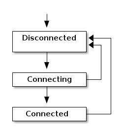

# CUBB Semantics

This text describes the requirements and expectations of the CUBB interface.

## General remarks:
This is an asynchronous interface.
 The following notation is used:

- Downward (client-to-CUBB) events are written like this:
 &darr;`Request`.
- Upward (CUBB-to-client) event are written like this:
 &uarr;`Notification`.
- Enumeration values are written like this:
  _SomeValue_.
- Open questions are marked with:
  **TODO**

Unless noted otherwise, all downward parameters must be non-null.

All upwards parameters are non-null unless otherwise noted. Fields named "errorMsg" may generally be null, except in the &uarr;`Error` event.

(All enum-typed values are never null.)

### Tunables
We define the following tunable parameters:
- `$VISIBILITY_TIMEOUT` = 1 second
- `$APPEARANCE_TIMEOUT` = 60 seconds

## Events and their constraints

### Setup
- &darr;`Initialize`:
  - Use of CUBB starts with &darr;`Initialize`.
  - **TODO**: Should there be some kind of "Ready"/"CUBBState" callback?
  (this could be used for disposal as well, if we are to add that.) (For now at least, the initial "AdapterScanState" can be used instead.)
  - &darr;`Initialize` must only be sent once.
  - Initial events: Shortly after initialization has been requested, a &uarr;`ScanStateChanged` is sent with the initial adapter state.

### Adapter scan state

- &darr;`SetScanState`:
  - When called with `false`, within reasonable time the scan state MUST transition to anything but _Scanning_ (if it isn't already).
  - When called with `true`, and the adapter is enabled, then the state will become _TurningOnScanning_ (a transient state) for a while, until the real result of the attempt is known.
  - **TODO**: Instead of this fairly brittle case-based response, we could add an "errorMsg" parameter to &uarr;`ScanStateChanged`, so that a &darr;`SetScanState` request always results in a &uarr;`ScanStateChanged` response,  with an errorMsg in case the operation was invalid.
- &uarr;`ScanStateChanged`:
  - The initial state must be one of _BluetoothUnavailable_/_BluetoothDisabled_/_NotScanning_.
The initial state must reflect the actual adapter state at initialization time.
  - The adapter scan states _TurningOnScanning_ and _Scanning_ must only happen as a result of a &darr;`SetScanState(true)` event.
   The other scan states may be entered at any time as a result of external events.

### Discovery

- &darr;`SetScanState` may be sent at any time (after &darr;`Initialize`).
- &uarr;`DeviceStateChanged`:
  - The manufacturerData field may be null.
  - Events with state=_Visible_ should only happen when the adapter scan state is _Scanning_.
   The service UUID must be one of the configured service UUIDs.
  - deviceID must be a valid device address, according to the platform.
  - A state of _Visible_ means that the device has been seen within the last `$VISIBILITY_TIMEOUT` period. After that, an device state event should mark the device as _Invisible_.
- &uarr;`DeviceDisappeared`:
  - This event is sent exactly when one of the following happens:
    1) A device has not been seen within the last `$APPEARANCE_TIMEOUT` period (&plusmn; a few seconds);
    2) The Bluetooth adapter has been disabled.
  - The deviceID must be one of a previously known, not yet disappeared device.

### Connection establishment

- &darr;`ConnectToDevice`:
  - Response: Within a reasonable time, a &uarr;`DeviceConnectionStateChanged` event must occur.
  - //If the device is not known, an &uarr;`Error` event is sent.
  - If the device is not known, or already connected, not connection attempt is made. Instead, a &uarr;`DeviceConnectionStateChanged` event is sent for the deviceID with the present state and errorMsg != null.
  - If the connection attempt fails, the device connection state must end in _Disconnected_ with errorMsg != null.
  - **TODO** CUBB should stop scanning while it is connected. Should it in some situations resume scanning once connected?
- &darr;`DisconnectFromDevice`:
  - Response: Within a reasonable time, a &uarr;`DeviceConnectionStateChanged` event must occur with state=_Disconnected_ (and the device should be disconnected).
- &uarr;`DeviceConnectionStateChanged`:
  - This event must only happen for known (and non-disappeared) devices.
  - state!=_Disconnected_ must only happen if a connection was requested.
  - errorMsg!=null should only happen if a connection was requested and failed, or if the connection was broken unexpectedly.

#### Remarks
The procedure for a client to reliably initiate a connection and await the result (assuming only one attempt is in progress at a time) is:

1. Set up listening for a &uarr;`DeviceConnectionStateChanged` event with the deviceID in question. State=_Connected_ means success, state=_Disconnected_ with errorMsg!=null means failure, any other state means failure because of an interrupting transition.
2. Send the &darr;`ConnectToDevice` message.

### Data transfer
- &uarr;`ReceivedPacket`:
  - This is sent for each packet received from a connected device.
  - Packet events are sent in-order (within each device connection), and are only dropped to the extent OS-and-lower levels drop the BLE packets.
  - &uarr;`ReceivedPacket` should only occur for deviceIDs which are known and have connectivity=_Connected_.
- &darr;`SendPacket`:
  - The packet is sent using BLE's "WriteWithoutResponse".
  - Response: None in the case of success; &uarr;`Error` in certain error cases, e.g. the device being unknown or in the wrong connection state.
  - Within each device connection, packets are sent in the sequence controlled by the Packet Replacement Algorithm (see below).
   In particular, packet order is reliable (packets are not reordered) in the following cases:
    - Between packets sent using &darr;`SendPacketNotifyOnDataTransmitted`.
    - Between packets sent using `SendPacket` with _group_=0.
    - Between packets sent using `SendPacket` within the same group with _NON&#x5f;REPLACEABLE_ set on all packets.
    - Between packets sent using `SendPacket` (even across  groups) with _NON&#x5f;OVERTAKING_ set on all packets.

  - Messages are only dropped to the extent the OS-and-lower levels drop the BLE packets.
- &darr;`SendPacketNotifyOnDataTransmitted`:
  - As &darr;`SendPacket`, except that:
    1. The packet is sent with BLE's "WriteWithResponse"
    2. If seqN&ge;0, when the BLE acknowledgement is received, a matching &uarr;`PacketTransmitted` event is sent.
  - Within reasonable time (and given that the BLE stacks follow specifications), one of the following things should happen: 1) A matching &uarr;`PacketTransmitted` event is sent (if seqN&ge;0), or 2) a matching &uarr;`DeviceConnectionStateChanged` event happens with state=_Disconnected_.
- &uarr;`PacketTransmitted`:
  - These message occur as responses to &darr;`SendPacketNotifyOnDataTransmitted` events. They indicate that the device has succesfully received and acknowledged the message in question.
  - All fields match those of the causing &uarr;`SendPacketNotifyOnDataTransmitted` message.
  - Within each device connection, &uarr;`PacketTransmitted` events occur in order corresponding to the order in which the packets were sent.

### Packet replacement
In certain cases, it is desirable to replace packets in the send queue, in order to simultaneously have a non-blocking send mechanism and being able to e.g. steer with joystick without excessive reaction delays.

CUBB supports this in a manner which keeps the control flow in the native part (which is preferable for latency as well as complexity reason). It is done by specifying a packet-replacement policy when sending the packet (i.e. when handling &darr;`SendPacket`).

The packet replacement policy works as follows:

  - We define a tunable parameter:
    `$PACKETS_PER_CONNECTION_EVENT` = 4; this is the number of packets which we presume can always be buffered in OS/driver without problems.
  - &darr;`SendPacket` has the two policy parameters:
    - _group_: int
    - _flags_: int (a bitmask)
    The semantics are as follows:
    - Packets with the same _group_ may replace each other under certain circumstances - with a later packet overwriting an earlier one.
    - One bit (_NON&#x5f;REPLACEABLE_) in _flags_ marks a packet as non-replaceable (and non-overtakeable, within the group). This can be used for priority packets.
    - Another bit (_NON&x5f;OVERTAKING_) in _flags_ means that the packet should not overtake packets in other groups.

The algorithm for handling a new outgoing packet is:
  - We keep a queue `queue` of outgoing packets not yet delivered to the OS/driver layer.
  - If `packet.group == 0`, simply enqueue the packet and return.
  - Find in the queue the latest packet of the same group.
     If none exists, simply enqueue the packet and return.
  - If the enqueued packet has the flag _NON&#x5f;REPLACEABLE_, then enqueue the packet and return.
  - If the new packet has the flag _NON&#x5f;OVERTAKING_, then:
    - if there is an _earlier_ packet in the queue with the same group, then remove the last enqueued packet.
    - in any case, enqueue the packet and return.
  - Otherwise, replace the enqueued packet with the new packet.

With this algorithm,
  - It is possible to turn off packet replacement - by setting the group to 0.
  - It is possible to send a "barrier" packet, e.g. for changing modes on a service, and not have that packet dropped or other packets for the same service overtaking it.
  - It is possible to have packet replacement and at the same time both keeping the packet order also between groups, and avoid that one group might be starved.

(**TODO** Should we support globally non-overtakeable packets as well?)

### Suggestions for improvements/additions:
#### **TODO** Reliable transport speedup
(Note: This is regarding e.g. firmware upgrades. At present, we have different strategies for the different platforms; On UWP we use WWR for this; on iOS and possible Android, we use a fixed throttling (10ms send interval).)

There is some ground between all-"without response" and all-"with response" which could be worth investigating.
Due to the nature of BLE (see e.g. https://punchthrough.com/blog/posts/maximizing-ble-throughput-on-ios-and-android), it appears reasonable to assume that all devices have queue sizes of at least 4 packets. If this holds, reliable acknowledged data transfer could be optimized as follows:

Consider a new (tentatively named) request &darr;`SendPacketWithSoftAck`(deviceID, service, gattCharacteristic, data, seqNr). Its semantics are as &darr;`SendPacket`, except that 1) it is sent using "WriteWithResponse" iff 4 or more "WriteWithoutResponse" packets have been sent since the last "WriteWithResponse" packet (or connection establishment), and 2) progress can be tracked as &uarr;`PacketTransmitted` events, like &darr;`SendPacketNotifyOnDataTransmitted`.

It is implemented as follows:
- Introduce a counter _nonAckSendCounter_.
- When processing a &darr;`SendPacket` request, increment _nonAckSendCounter_ (saturating to _MAX_INT_VALUE_).
- When processing a &darr;`SendPacketNotifyOnDataTransmitted` request, reset _nonAckSendCounter_ to zero.
 - When processing a &darr;`SendPacketWithSoftAck` request,
 check whether _nonAckSendCounter_ &ge; 4; if yes, send with "WriteWithResponse" and reset _nonAckSendCounter_, otherwise send with "WriteWithoutResponse" and increment the counter.
 - In any case, remember the seqNr (if &ge; zero).
 - When getting an acknowledgement, send &uarr;`PacketTransmitted` events for all stored seqNrs up to the packet in question.

This would give reliable transportation _assuming_ that the BLE stack implementations on either side have a capacity of at least 4 (which seems reasonable), and would result in 4&times; the transfer speed.
